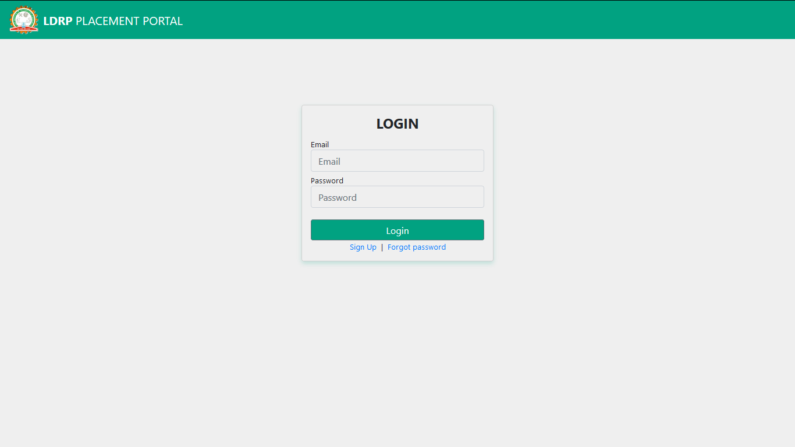
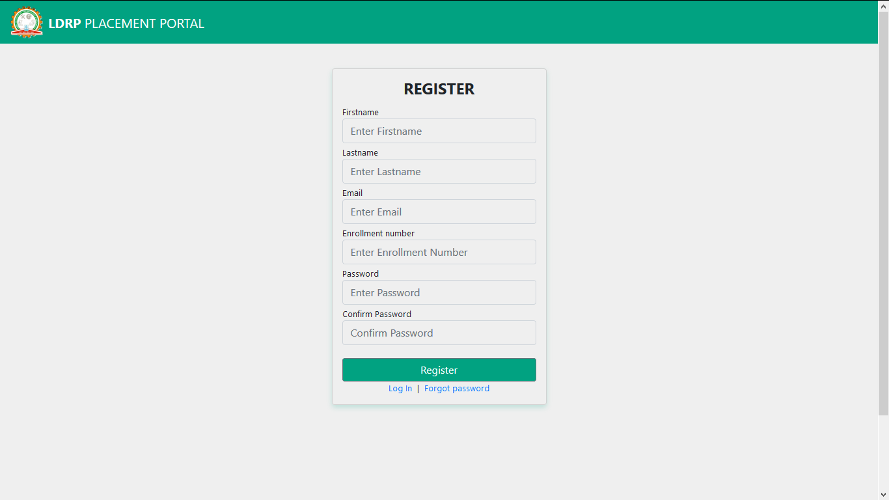
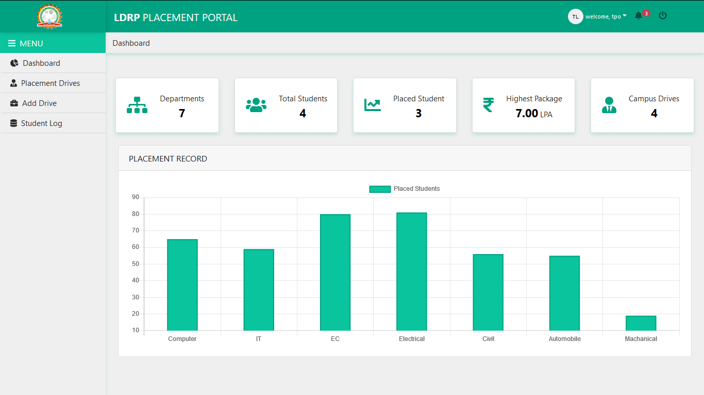
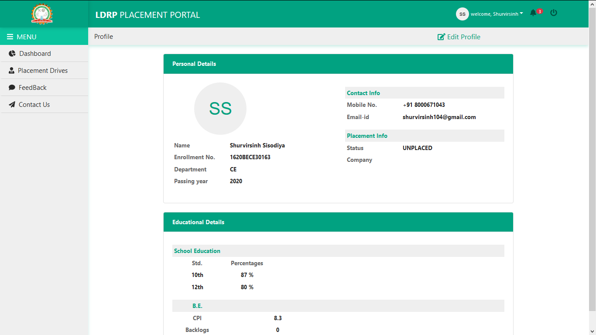
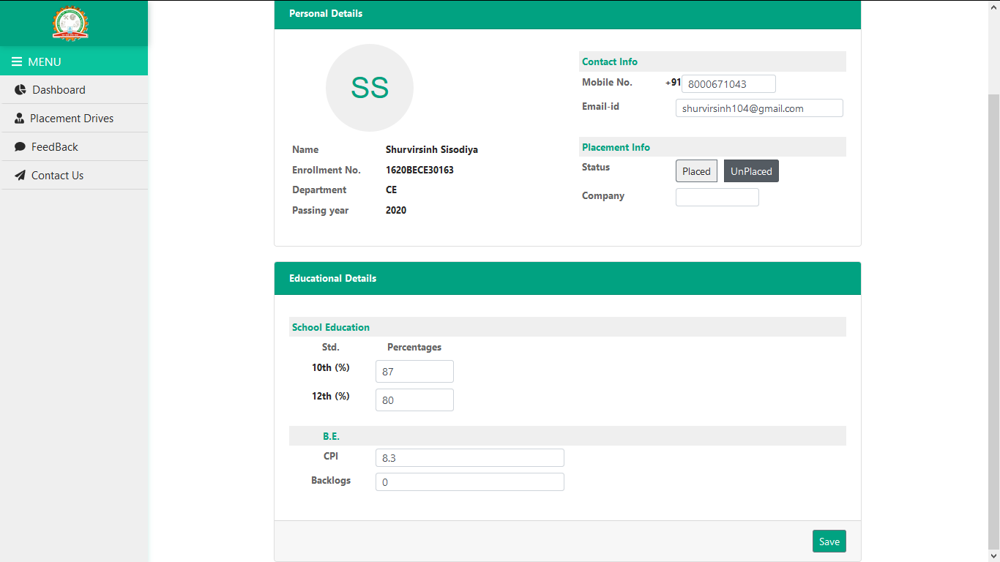
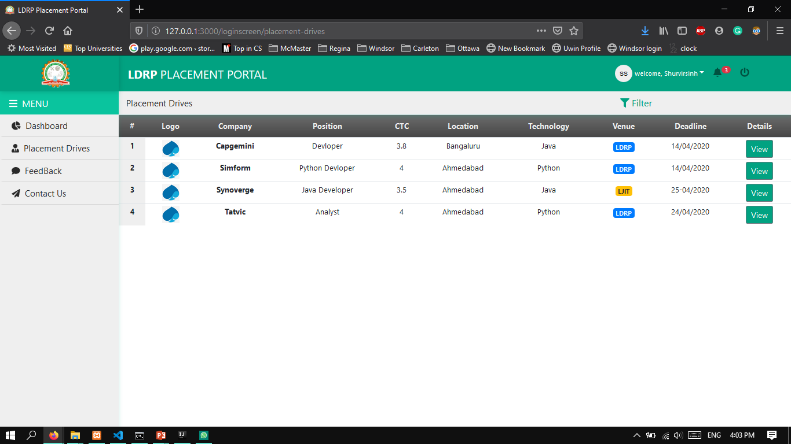
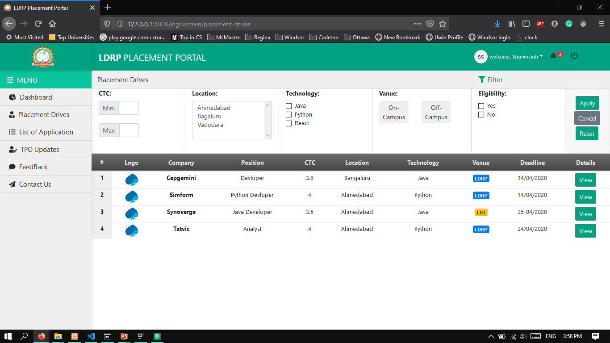
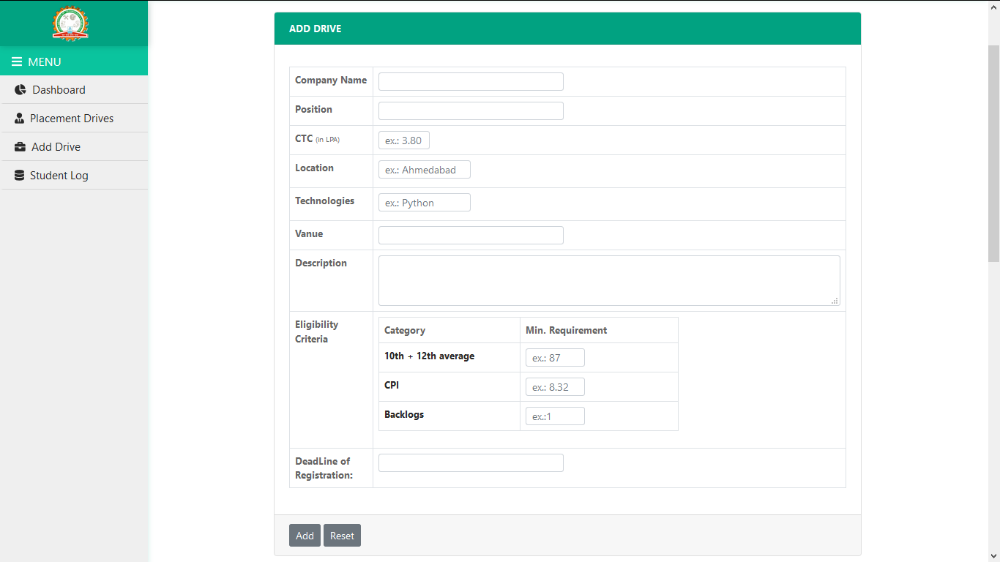
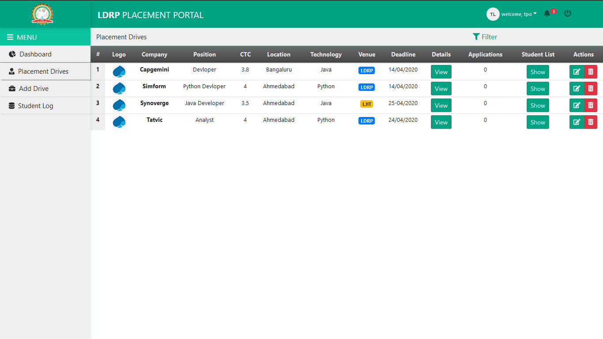
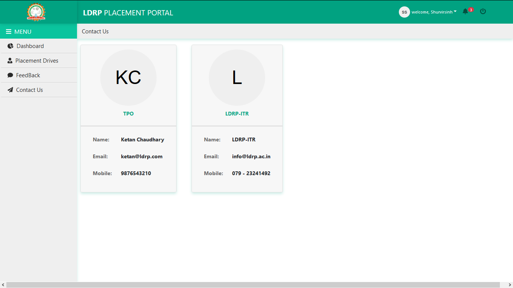

# placement-portal
It is React JS based frontend of my 8th sem project.

### Screenshots
- Login Page :

- Registration Page :

- Dashoard :

- Student Profile :

- Edit profile :

- Placement Drives (student module) :

- Drive Filtering :

- Add drive form (TPO) :

- Placement drives (TPO module) :

- Contact Us :

